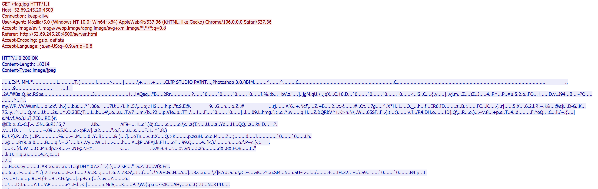

# beg_for_a_peg (forensics)

## 問題設定
pcapファイルが与えられるのでそこから画像を抽出する

## 解法
TCPストリームを追うと3回ぐらい画像を送信していることが分かるので、`flag.jpeg`を送信しているものを抽出する

ここから画像部分のみを抽出したいのだが、やり方がわからなかったので`vi`のバイナリモードで開いて先頭部分を手動で消したら以下の画像が得られた

