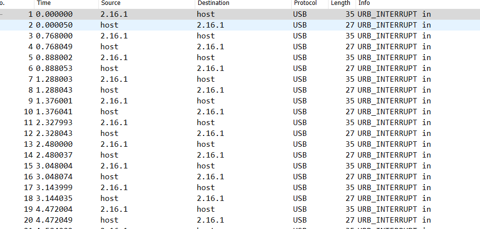

# lowkey_messedup (forensics)

## 問題概要
`pcap`ファイルが与えられる

## 解法
パケットの中身を見てググるとどうやらキーボード入力のデータであることが分かる

`tshark`を使ってデータを取り出して、パースして、を途中までやっていたが、ググって見つかった https://github.com/WangYihang/UsbKeyboardDataHacker/blob/master/UsbKeyboardDataHacker.py のスクリプトを使うとフラグが取得できた
